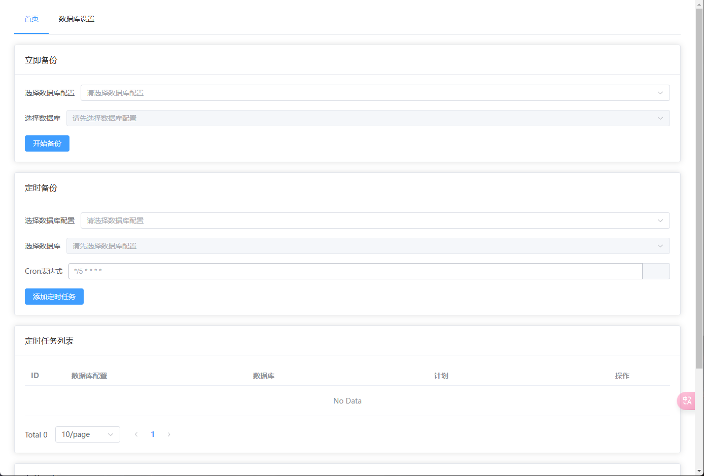
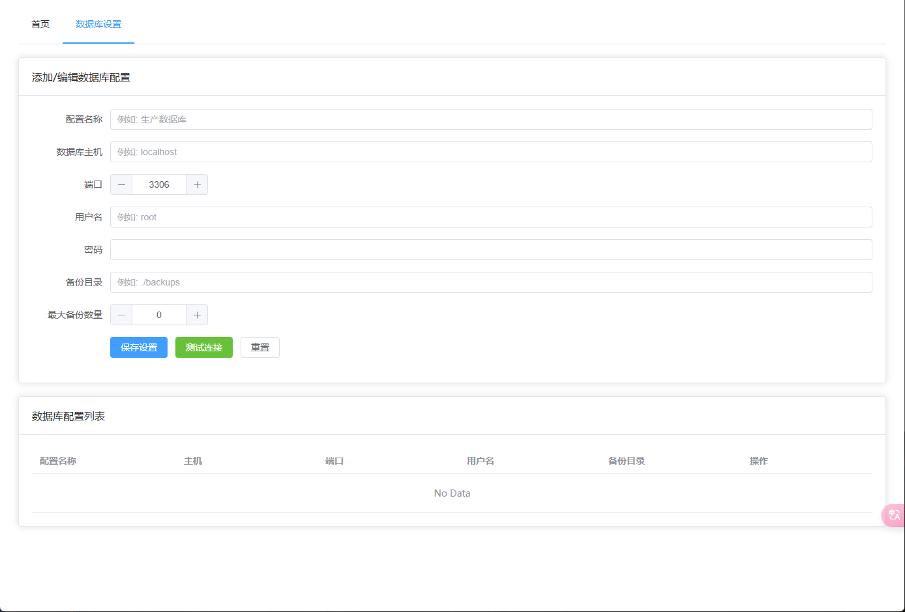

# DataSafe - MySQL数据库备份工具

DataSafe 是一个简单易用的MySQL数据库备份管理工具，提供Web界面操作，支持手动备份和定时备份功能。

## 功能特点

- 🚀 简单易用的Web界面
- 📊 支持Mysql数据库备份
- ⏰ 灵活的定时备份计划
- 💾 备份文件管理
- 🔍 数据库连接测试
- 🔒 安全可靠的存储

## 系统要求

- Go 1.23.4 或更高版本
- MySQL/MariaDB 数据库

## 快速开始

1. 克隆仓库
```bash
git clone https://github.com/xinggaoya/DataSafe.git
cd DataSafe
```

2. 安装依赖
```bash
go mod download
```

3. 配置数据库连接
在Web界面的设置页面中配置以下信息：
- 数据库主机地址
- 数据库端口
- 用户名
- 密码
- 要备份的数据库列表

4. 运行程序
```bash
go run main.go
```

5. 访问Web界面
打开浏览器访问 `http://localhost:6680`

## 使用说明

### 手动备份
1. 在Web界面选择需要备份的数据库
2. 点击"立即备份"按钮
3. 等待备份完成

### 定时备份
1. 进入定时任务页面
2. 设置备份计划（支持cron表达式）
3. 选择需要备份的数据库
4. 保存定时任务

### 备份文件管理
- 查看所有备份文件
- 下载备份文件
- 删除过期备份

## 主要依赖

- gin-gonic/gin: Web框架
- go-sql-driver/mysql: MySQL驱动
- robfig/cron: 定时任务
- etcd.io/bbolt: 键值存储

## 预览




## API接口

- GET `/api/databases` - 获取数据库列表
- GET `/api/backups` - 获取备份列表
- POST `/api/backup` - 创建新备份
- GET `/api/schedules` - 获取定时任务列表
- POST `/api/schedules` - 创建定时任务
- DELETE `/api/schedules/:id` - 删除定时任务
- GET `/api/settings` - 获取设置
- POST `/api/settings` - 保存设置
- POST `/api/test-connection` - 测试数据库连接
- GET `/api/backup-files` - 获取备份文件列表
- DELETE `/api/backup-files/:filename` - 删除备份文件
- GET `/api/backup-files/:filename` - 下载备份文件

## 许可证

MIT License

## 贡献指南

1. Fork 本仓库
2. 创建你的特性分支 (`git checkout -b feature/AmazingFeature`)
3. 提交你的改动 (`git commit -m 'Add some AmazingFeature'`)
4. 推送到分支 (`git push origin feature/AmazingFeature`)
5. 发起 Pull Request

## 问题反馈

如果你在使用过程中遇到任何问题，欢迎：
- 提交 [Issue](https://github.com/xinggaoya/DataSafe/issues)
- 发起 [Pull Request](https://github.com/xinggaoya/DataSafe/pulls) 